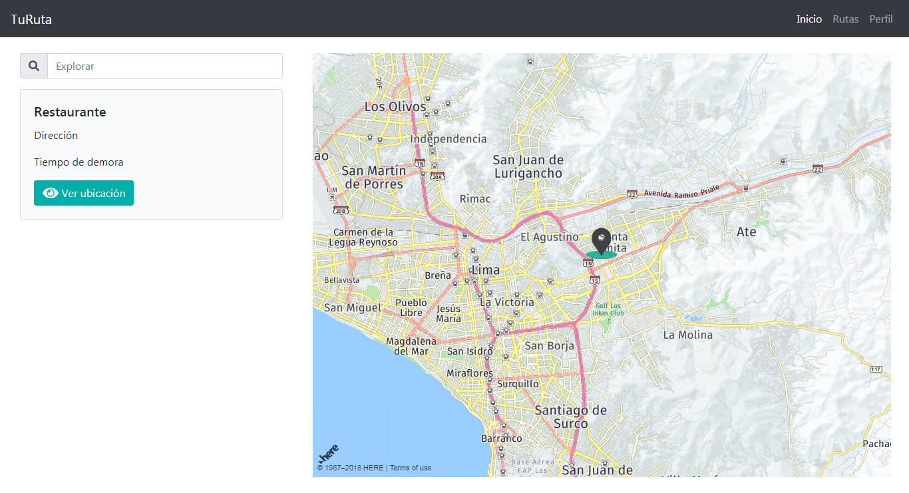

# TuRuta

* **Reto:** _Here Maps_

***

## Introducción

Aplicación que permite a los usuarios trackear y monitorear recorridos que realice en senderos al aire libre/outdoor, orientado a los amantes de las actividades de aventura (montañas, lagos, parques, etc.) en Perú.

## Plan de trabajo

Para el proyecto se crearon los siguientes issues y milestones que sirven como hoja de ruta (roadmap):

* Maquetado.
* Enlazar proyecto con API.
* Obtener mapa con coordenadas solicitadas al usuario.
* Solicitar punto de partida y destino al usuario y trazar en mapa.
* Elaborar readme.

## Especificaciones

* Se utilizó el framework bootstrap en su versión 4.
* Diseño responsive y mobile.

## Instrucciones 
Para usar la aplicación, siga los siguientes pasos:

```bash
git clone https://eliza29.github.io/Proyecto-Heremaps/index.html
cd Proyecto-Heremaps
```

***

## Uso
* Se tiene una barra de navegación donde se presentan tres vistas principales de la aplicación.
* Se tiene la vista Inicio, donde se imprime un mapa con la ubicación del usuario, para ello, el usuario deberá permitir la obtención de su ubicación.
* Se tiene la vista Rutas, donde el usuario puede trazar una ruta, para ello, debe ingresar un punto de partida y un punto de destino.
* Se tiene la vista Perfil, donde el usuario tiene una lista de sus rutas guardadas.

## Ejemplo

* Vista home:



* Vista rutas:


* Vista perfil:


***

## Autoras

* Elizabeth Segura
* Rocci Escobar 